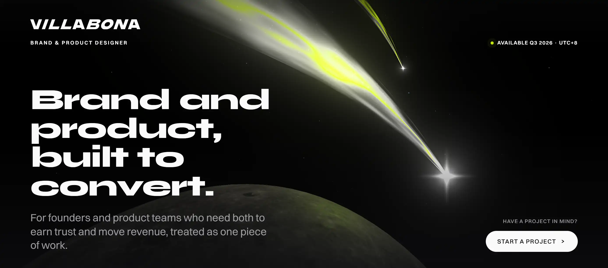

<div align="center">
  
</div>

<div align="center">

[](https://villabona.studio)

</div>

<p align="center">
  
  
  
</p>

<p align="center">
  <a href="https://villabona.studio"></a>
  <a href="mailto:hello@villabona.studio"></a>
  <a href="https://www.linkedin.com/in/tjvllbn/"></a>
  <a href="https://t.me/tjvillabona"></a>
</p>

---

### About

I'm Tristan. I design brands and the products they live in: identity, websites, e-commerce, and software interfaces, treated as one story instead of two separate jobs. I've spent 5+ years across brand, product, and motion, with UI/UX as a newer, sharp focus. Founders get direct access to the person doing the work and one point of accountability for the result.

---

### Disciplines

| | |
|---|---|
| Brand identity | Names, marks, systems |
| Product design | Web and app interfaces |
| Web and motion | Sites, animation, code |
| Creative direction | Concept through launch |
| 3D and visualization | Renders, scenes, product |
| Print and environment | Collateral, signage, stage |

---

### Stack

**Design**
<p>       </p>

**Build**
<p>        </p>

---

### Selected work

**[Gensan Coffee Association](https://villabona.studio/work/coffee-association)**
<br/>
  

**[Verse](https://villabona.studio/work/verse-webstore)**
<br/>
  

**[UPCPI CMD Media & Production](https://villabona.studio/work/upcpi-cmd)**
<br/>
  

**[Pawnshop management system](https://villabona.studio/work/pawnshop-system)**
<br/>
  

---

### How the work moves

```
Scope   surface the real problem, lock the brief on outcomes
Build   design and develop in tight loops, brand and product in parallel
Ship    hand off systems and front-end a team can actually run
```

One story, brand to product. Full range, one hand, no handoffs.

---

### Activity

<p align="center">
  
</p>

---

<p align="center">
  Based in the Philippines, UTC+8. Available Q3 2026. Open to remote.
  <br/>
  <strong><a href="https://calendly.com/tjvllbn">Book a call</a></strong>
</p>
